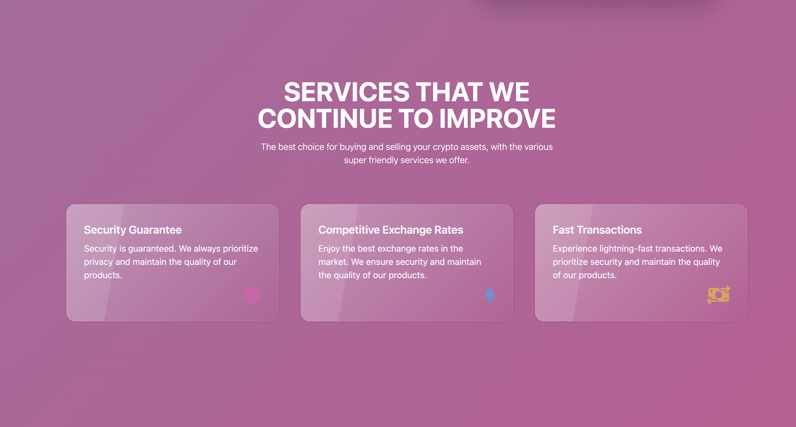

# CoinHeaven Crypto Wallet App

CoinHeaven is a decentralized cryptocurrency wallet app that allows users to send and receive Ethereum (ETH) transactions. The app works with MetaMask, a popular Ethereum wallet browser extension. Users can interact with the Ethereum blockchain, view transaction history, and send transactions to other Ethereum addresses. The smart contract used by the app is deployed to the Alchemy network.

## Demo
You can access the live demo of the CoinHeaven app at https://coin-heaven.vercel.app/.

## Tech Stack
The CoinHeaven app is built using the following technologies:

### Frontend:

- React: A JavaScript library for building user interfaces.
- Vite: A fast build tool and development server.
- Tailwind CSS: A utility-first CSS framework for rapid UI development.
- ethers.js: A library for interacting with Ethereum blockchain and smart contracts.
- react-hook-form: A library for managing form state and validation in React.
- framer-motion: A library for adding smooth animations to React components.

### Smart Contract:

- Solidity: A high-level language used to write Ethereum smart contracts.
- Hardhat: A development environment for compiling, deploying, and testing smart contracts.
- Alchemy: An Ethereum development and API platform.

## Prerequisites

Before running the app locally or deploying it, make sure you have the following installed:

- Node.js (Recommended version: 14.x or higher)
- NPM (Recommended version: 6.x or higher)
- MetaMask Extension installed in your browser (https://metamask.io/)

## Installation and Setup
1. Open your terminal or command prompt.
```bash
git clone https://github.com/davewaldorf/CoinHeaven.git
```
2. Change to the client directory and install the dependencies:
```bash
cd client
npm install
```
3. Change to the smart_contract directory and install the dependencies:
```bash
cd ../smart_contract
npm install
```
4. Running the App Locally
Start the local development server for the client:
```bash
cd client
npm run dev
```
5. Deploy the smart contract to the Sepolia network:
```bash
cd smart_contract
npx hardhat run scripts/deploy.js --network sepolia
```
Open your web browser and visit http://localhost:3000 to access the CoinHeaven app.

## Using the App
- Connect MetaMask Wallet: Click on the "Connect Wallet" button to connect your MetaMask wallet to the app.

- Send Transactions: Once your wallet is connected, you can enter the recipient's Ethereum address, transaction amount in ETH, a keyword for a GIF, and an optional message. Click on the "Send Now" button to initiate the transaction. MetaMask will prompt you to confirm the transaction.

- Transaction History: You can view your transaction history on the "Transactions" section. It will display the relevant details of each transaction you have made.


## Smart Contract Deployment
The smart contract is deployed to the Sepolia network using Hardhat. To deploy it to a different network, modify the hardhat.config.js file in the smart_contract directory with the appropriate network details.

## Credits
The CoinHeaven app is developed by Dave Waldorf.

### License
This project is licensed under the MIT License. Feel free to use and modify it for your needs.

Feel free to reach out to Dave Waldorf (dave.waldorf@me.com) if you have any questions or need further assistance with the CoinHeaven app. Happy crypto transactions!





